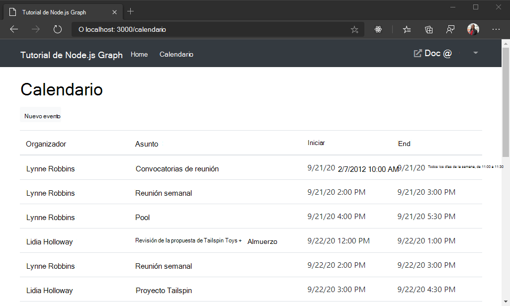

<!-- markdownlint-disable MD002 MD041 -->

En este ejercicio, incorporará Microsoft Graph a la aplicación. Para esta aplicación, usará la biblioteca de [Microsoft-Graph-Client](https://github.com/microsoftgraph/msgraph-sdk-javascript) para realizar llamadas a Microsoft Graph.

## <a name="get-calendar-events-from-outlook"></a>Obtener eventos de calendario de Outlook

1. Abra `./graph.js` y agregue la siguiente función dentro `module.exports`de.

    :::code language="javascript" source="../demo/graph-tutorial/graph.js" id="GetEventsSnippet":::

    Tenga en cuenta lo que está haciendo este código.

    - La dirección URL a la que se `/me/events`llamará es.
    - El `select` método limita los campos devueltos para cada evento a solo aquellos que la vista usará realmente.
    - El `orderby` método ordena los resultados por la fecha y hora en que se crearon, con el elemento más reciente en primer lugar.

1. Cree un nuevo archivo en el `./routes` directorio denominado `calendar.js`y agregue el siguiente código.

    ```javascript
    var express = require('express');
    var router = express.Router();
    var tokens = require('../tokens.js');
    var graph = require('../graph.js');

    /* GET /calendar */
    router.get('/',
      async function(req, res) {
        if (!req.isAuthenticated()) {
          // Redirect unauthenticated requests to home page
          res.redirect('/')
        } else {
          let params = {
            active: { calendar: true }
          };

          // Get the access token
          var accessToken;
          try {
            accessToken = await tokens.getAccessToken(req);
          } catch (err) {
            res.json(err);
          }

          if (accessToken && accessToken.length > 0) {
            try {
              // Get the events
              var events = await graph.getEvents(accessToken);

              res.json(events.value);
            } catch (err) {
              res.json(err);
            }
          }
          else {
            req.flash('error_msg', 'Could not get an access token');
          }
        }
      }
    );

    module.exports = router;
    ```

1. Actualice `./app.js` para usar esta nueva ruta. Agregue la siguiente línea **antes** de `var app = express();` la línea.

    ```javascript
    var calendarRouter = require('./routes/calendar');
    ```

1. Agregue la siguiente línea **después** de `app.use('/auth', authRouter);` la línea.

    ```javascript
    app.use('/calendar', calendarRouter);
    ```

1. Reinicie el servidor. Inicie sesión y haga clic en el vínculo de **calendario** en la barra de navegación. Si todo funciona, debería ver un volcado JSON de eventos en el calendario del usuario.

## <a name="display-the-results"></a>Mostrar los resultados

Ahora puede Agregar una vista para mostrar los resultados de forma más fácil de uso.

1. Agregue el siguiente código en `./app.js` **después** de `app.set('view engine', 'hbs');` la línea.

    :::code language="javascript" source="../demo/graph-tutorial/app.js" id="FormatDateSnippet":::

    Esto implementa una [aplicación auxiliar de manillar](http://handlebarsjs.com/#helpers) para dar formato a la fecha ISO 8601 devuelta por Microsoft Graph en algo más fácil de ser humano.

1. Cree un nuevo archivo en el `./views` directorio denominado `calendar.hbs` y agregue el siguiente código.

    :::code language="html" source="../demo/graph-tutorial/views/calendar.hbs" id="LayoutSnippet":::

    Se recorrerá en bucle una colección de eventos y se agregará una fila de tabla para cada uno.

1. Ahora, actualice la ruta `./routes/calendar.js` en para usar esta vista. Reemplace la ruta existente por el siguiente código.

    :::code language="javascript" source="../demo/graph-tutorial/routes/calendar.js" id="GetRouteSnippet" highlight="16-19,26,28-31,37":::

1. Guarde los cambios, reinicie el servidor e inicie sesión en la aplicación. Haga clic en el vínculo del **calendario** y la aplicación ahora debe representar una tabla de eventos.

    
